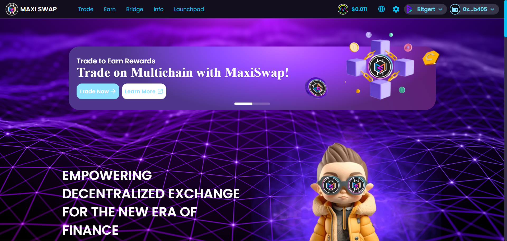
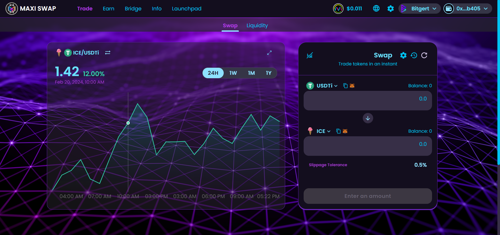
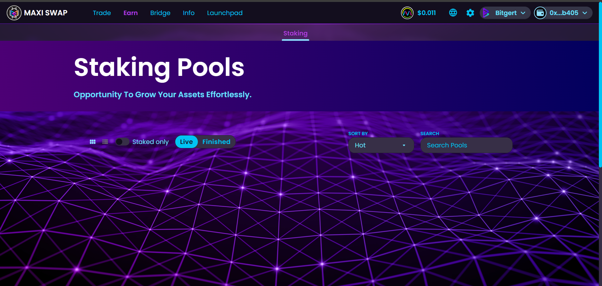
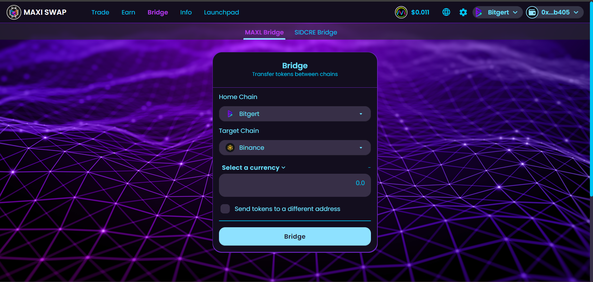

# Maxiswap - Decentralized Exchange Platform

Welcome to the official repository for Maxiswap, a comprehensive decentralized exchange (DEX) platform developed by Decypher Labs for our esteemed clients. Maxiswap is a fork of Pancakeswap, optimized for the Core Blockchain, and offers a full suite of features including trading, staking, bridging, and a launchpad for new projects. Our platform is designed to provide users with a seamless and secure way to engage with the cryptocurrency market.

Explore Maxiswap: [https://maxiswap.org/?chainId=32520](https://maxiswap.org/?chainId=32520)

## Features

- **Trading**: Swap tokens with ease, benefiting from low transaction fees and fast settlement times.
- **Staking**: Stake your tokens to earn rewards, with various pools available to suit different risk appetites.
- **Bridging**: Seamlessly bridge assets between Core Blockchain and other networks, expanding your trading and investment opportunities.
- **Launchpad**: Access early-stage token sales and invest in promising projects at their inception.

## Getting Started

### Requirements

- A web3-enabled browser or a wallet app compatible with Core Blockchain.
- Core Blockchain-compatible tokens for trading, staking, or bridging.

### How to Use Maxiswap

1. **Connect Your Wallet**: Visit [Maxiswap](https://maxiswap.org/?chainId=32520) and connect your wallet by selecting the "Connect" option.

2. **Navigate the Platform**: Use the navigation bar to access different features such as Trading, Staking, Bridging, or the Launchpad.

3. **Engage with Features**: Select the feature you wish to use and follow the on-screen instructions to trade, stake tokens, bridge assets, or participate in launchpad projects.

## Interface Overview

Maxiswap boasts a user-friendly interface, making it easy for users to navigate and utilize its features. Here are some snapshots of our platform:

### Trading Interface

Efficiently swap tokens through our intuitive trading interface.

### Staking Pools

Explore various staking pools and earn rewards on your assets.

### Bridging Assets

Utilize our bridging feature to move assets across different blockchains.

